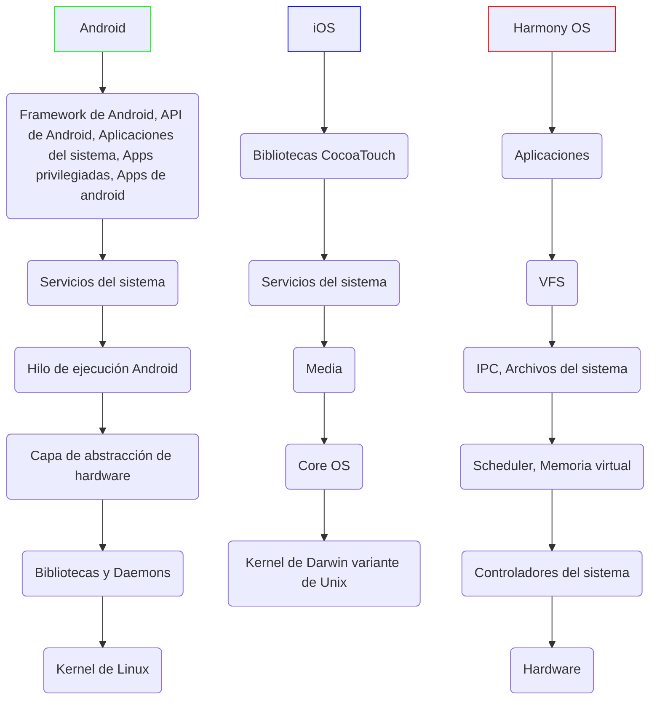

# Programacion_Dispositivos_Moviles
## Aquí subiré los archivos y practicas relacionadas con la asignatura.

### Diagrama Estructura basica de los SO moviles.

```mermaid
flowchart TD

    A:::bar & B:::foobar & C:::foo
    classDef foo stroke:#f00
    classDef bar stroke:#0f0
    classDef foobar stroke:#00f

    A["Android"] -->
        E(Framework de Android, API de Android, Aplicaciones del sistema, Apps privilegiadas, Apps de android)
        E --> F(Servicios del sistema) --> G(Hilo de ejecución Android) --> H(Capa de abstracción de hardware) --> I(Bibliotecas y Daemons) --> J(Kernel de Linux)


    B["iOS"] --> 
        K(Bibliotecas CocoaTouch) --> L(Servicios del sistema) --> M(Media) --> N(Core OS) --> O(Kernel de Darwin variante de Unix)


    
    C["Harmony OS"] --> 
        P(Aplicaciones) --> Q(VFS) --> R(IPC, Archivos del sistema) --> S(Scheduler, Memoria virtual) --> T(Controladores del sistema) --> U(Hardware)
```
  
